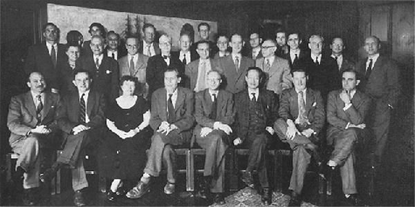
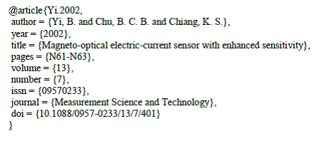

# A Story about Cybernetics

## Cybernetics

## The Macy Conferences

## John von Neumann

## Kurt Lewin

# Introduction

## Ian Dennis Miller

- PhD Candidate, Social Psychology
- Psychology Department
- Studying: Social Complexity and Collective Intelligence
    + agent-based modelling
    + experimental psychology
    + memes
- Academic background
    - BS Cognitive Science, Carnegie Mellon University
    - Research Analyst, Berkeley
    - MA Psychology, University of Toronto
- http://imiller.utsc.utoronto.ca

## Overview {.side-image .smaller}

- social psychology meets artificial intelligence
- gh-impact: the influence of Individuals and Organizations in open source software
- memelab: human meme experiment and campus-scale simulation
- rofo: the Rob Ford network
- topoli: individuals and the crowd
- urban legend transmission
- 2016 US presidential candidates and the memes created about them
- pplapi: a computer simulation of the human population

# social psychology meets artificial intelligence

## Academic collaboration network {.side-image}

- Lewin and von Neumann meet at Macy 1 and 2:
    - March 1946
    - October 1946
- consider that moment in time as a starting point
- imagine spidering their social networks
- social net with one particular constraint
    + authors are linked via co-authorship

## Leveraging BibTeX {.side-image}

- database of citations
- BibTeX is the interchange format
    + read/write citations
    + compatible with everything
        - R
        - Python
        - LaTeX
    + ugly, but good enough
- library consists of $n \approx$ 2500 citations

## Visualizing the network {.side-image}

- identify the largest component
    + $n_{authors} = 1574$
    + $n_{edges} = 4905$
- look at 2nd-largest component for authors who are missing a link
- calculate modularity (stochastic) to identify communities
- http://imiller.utsc.utoronto.ca
    + [/media/network/](http://imiller.utsc.utoronto.ca/media/network/)

## {.fill .nobackground}

<video class="big-video" controls autoplay>
<source src="assets/academic-network.mp4" type="video/mp4">
</video>

## Insights

# interlude: pub2

## What is publication?

- publication in 2016, that is
- prepub:
    - arXiv
    - SSRN
    - fooXiv

## Targeting Google Scholar

- goal: get BibTeX indexed
- digital object identifier
    + DOI
    + PURL (meh)
- archival format
    + PDF
    + HTML

## learn more about pub2

# memelab (2012)

# 2016 US presidential candidates and the memes created about them

## Slide {.side-image}

# urban legend transmission

## Slide {.side-image}

# the influence of Individuals and Organizations in open source software

## Slide {.side-image}

# a computer simulation of the human population

## Slide {.side-image}

# the research literature of social psychology and artificial intelligence

## Slide {.side-image}

# Conclusion

## Thank you
