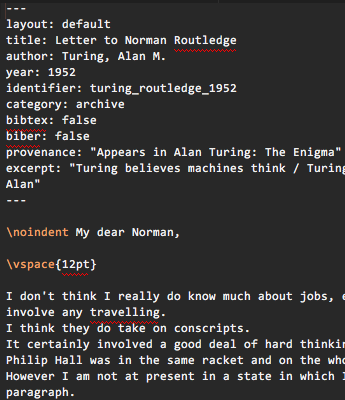
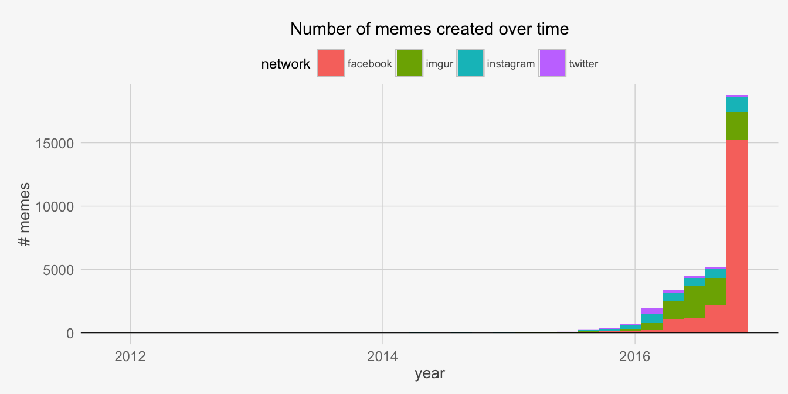

# A Story about Cybernetics

## Cybernetics {.side-image}

- observations of human/machine interactions during World War 2
    + computer-assisted anti-aircraft guns
    + inspired by / enabled systems analysis
- from Greek *kybernetike* for "governance"
- feedback loops: outputs connected to inputs
- the foundational meetings were the Macy Conferences

## The Macy Conferences {.side-image}

- started in 1946, in New York City
- early Computer Scientists (there were about 3 digital computers in existence)
    - John von Neumann, Norbert Wiener, Warren McCullouch, JCR Licklider, and many others
- psychologists from the Gestalt school
    + Kurt Lewin, Wolfgang Köhler
    + "the whole is different from the sum of its parts"
    + attracted to systems/feedback loops

## John von Neumann {.side-image}

- the original hacker?
    + simulated nuclear explosions in WW2
    + wrote code for ENIAC, UNIVAC, whatever
    + *no programming language had been invented yet*
- pioneer of big data
- von Neumann computer architecture
- very active in academic society
    + at the right place at the right time
    + repeatedly
+ Influenced: Mandelbrot, Feynman, Wolfram

## Kurt Lewin {.side-image}

- sometimes called the father of Social Psychology
- Field Theory: $B = f(P, S)$
    + **behaviour** is a function of the **person** and their **situation**
    + people respond differently to different situations
        + our perceptions are part of the situation
- Lewin presented Field Theory at the 2nd Macy Conference.
- Influenced: Köhler, Bandura, Mischel, Shioda

## Missed Connections {.side-image}

- Cybernetic movement rapidly collapsed
    + Artificial Intelligence partly took up the cause
    + Computer Science sortof dominated
    + Psychology, despite studying mind and brain, remained at a distance
- Social Psychology and Personality Psychology split over Lewin's Theory
    + possibly for lack of a computational, analytic framework?
- the students of von Neumann never connected with the students of Lewin

# Introduction

## Ian Dennis Miller {.side-image}

- PhD Candidate, Social Psychology
- Psychology Department
- Studying: Social Complexity and Collective Intelligence
    + agent-based modelling
    + experimental psychology
    + social network analysis
    + memes
- Academic background
    - BS Cognitive Science, Carnegie Mellon University
    - Research Analyst, Berkeley
    - MA Psychology, University of Toronto
- http://imiller.utsc.utoronto.ca

## Structure of presentation {.side-image .bigger}

- buffet sample pack
- back-to-back "lightning talks"
- questions
    - please ask for clarification
    - please save theoretical questions until the end

## Overview {.side-image}

- social psychology meets artificial intelligence
- **pub2**: self publishing
- **memelab**: meme sharing
- **topoli**: twitter political memes
- **rofo**: Rob Ford social network
- **urban legends**: memes and network topologies
- **gh-impact**: influence in open source software
- **election-memes**: 2016 US election memes
- **pplapi**: human simulacrum as a service

<!--
- simulating the contact effect
- gthnk
- flask-diamond
- urban legend transmission

-->

# Social Psychology meets Artificial Intelligence | diving into the academic social network

## Academic collaboration network {.side-image}

- Lewin and von Neumann meet at Macy 1 and 2:
    - March 1946
    - October 1946
- consider that moment in time as a starting point
- imagine spidering their social networks
- social network with one particular constraint:
    + authors must be linked via co-authorship

## Leveraging BibTeX {.side-image}

- database of citations
- BibTeX is the interchange format
    + read/write citations
    + compatible with everything
        - R
        - Python
        - LaTeX
    + ugly, but good enough
- my Zotero library consists of $n \approx$ 2500 citations
    + autoexport plugin syncs a .bib file

## Visualizing the network | [http://imiller.utsc.utoronto.ca/media/network/](http://imiller.utsc.utoronto.ca/media/network/) {.side-image}

- identify the largest component
    + $n_{authors} = 1574$
    + $n_{edges} = 4905$
- look at 2nd-largest component for authors who are missing a link
    + library is curated, not randomly sampled
- calculate modularity (stochastic) to identify communities
    + $n_{communities} = 34$

## {.video-slide}

<video controls autoplay>
<source src="assets/coauthorship/academic-network.mp4" type="video/mp4">
</video>

## Insights {.side-image}

- situated myself in the citation graph
- citation data "in the wild" are very poor quality
- the communities (detected by modularity) seem plausible
- some communities resisted collaboration
    + Royal Society
    + US and UK WWII computer scientists
    + CS and Psychology sides of AI
- von Neumann is *very* distantly connected to Lewin's students
    + Lewin's death may have dashed any chances of a collaboration

# Pub2 | a brief interlude on the subject of online scholarship

## What is publication? {.side-image .bigger}

- publication in 2016, that is
- where do you publish?
- where do you find articles?
- **pub2**: a system for self-publishing
    + all you need is a PDF and a .bib file that links to it

## Where do you publish? {.side-image .smaller}

+ books
+ conferences
    * proceedings
    * presentations
+ journals
    * science-wide
    * discipline-specific
+ pre-publication:
    - arXiv
    - SSRN
    - fooXiv
- **self-publication??**

## Where do you find articles? {.side-image .bigger}

- citeseer/citeulike/worldcat
- pubmed/government portal
- publisher search (ha!)
- open journals
- university or public library
- Google scholar
    - warning: you will be rate-limited

## Self-publication {.side-image .bigger}

- goal: get BibTeX indexed by Google Scholar
- digital object identifier?
- serve it yourself.  Google don't care
- archival format
    + HTML?
    + PDF
- **pub2** is a system for making this realistic

## Pub2 {.side-image}

- like Jekyll (static site generator) for PDFs
    - generates PDF and .bib file that links to PDF
    - simple LaTeX isn't so different from Markdown
    - YAML preamble/templating like Jekyll
    - actually sits on top of an existing Jekyll install
- more info
    + `pip install pub2`
    + http://pub2.readthedocs.io

# Memelab | human behaviour, viral phenomena, and social simulation

## Memes {.side-image .bigger}

- this is where my research started in 2011
- Dawkins (1976): cultural replicator
- *viral*: in epidemic modelling, when there is faster infection than recovery
- image macro: the style of meme consisting of a background picture and inset captions
- memes have been used in psychological research for decades
    + “a method in which greeting cards are used to examine how parents communicate with their children” (Cacioppo & Andersen, 1981)

## What is memelab? {.side-image .bigger}

- online behavioural laboratory
- software on a web server
- clone of other meme creator websites (ecology)
- formerly, was only at http://meme8.com

## Method {.side-image .bigger}

- participants use memelab to create sharable memes in the lab (after survey)
- memelab hosts the images with a unique URL
- any time an image is viewed by an online user, this is logged as a “hit.”

## Experiment {.side-image}

- participants
    - UTSC undergrads
    - n=118 participants
    - each participant created 2 memes (total = 236)
    - 50% had created memes before study
- Demo
    - pick a background picture
    - put words at the top and bottom of the picture
    - use sharing interface so friends can see meme

## {.video-slide}

<video controls autoplay>
<source src="assets/memelab/meme8_quick.mp4" type="video/mp4">
</video>

Usage of meme8.com

## A meme created in the study {.image-slide}

## Cumulative Hits {.image-slide}

## Hits per meme {.image-slide}

<!-- ## Model of viral impact {.image-slide}

 -->

## Model: intention to share {.side-image}

<!-- arrow -->

- model incorporates features of the content
    - boolean values
    - subject: the meme is academic or not (in this study: animal)
    - language: the meme caption includes self-reference words or not
- model also incorporates ratings
    - meme is funny
    - personally meaningful

## Convert to S-I-R model {.side-image .bigger}

- SIR in Agent-Based Modelling
    - Susceptible
    - Infected
    - Recovered
- use slopes from linear model.
- use gaussian noise to create a distribution of random memes.
- threshold (0.5) makes the function into a "trigger" that can lead to infection.

## The simulation algorithm {.side-image}

- At each time “tick”
- the experiment wanders the space
- and recruits any agents who happen to be in the vicinity.
- Recruited agents create a meme (based on gaussian noise)
- and those agents share with a probability determined by the regression function.
- Infections signified by agent remarking, “Seen it.” An edge arrow tracks infection.

## {.video-slide}

<video controls autoplay>
<source src="assets/memelab/memelab.mp4" type="video/mp4">
</video>

example run of Repast simulation

## Simulation results, compared

## Summary {.side-image .bigger}

- behavioural data from participants
- model of intention to share
- "ported" sharing model to an agent-based model
- run simulation and obtained similar results

# &#35;topoli | individuals, group influence, and political memes

## &#35;topoli {.side-image .bigger}

- a hash tag is used to channel tweets towards interested audiences
- topoli = **to**ronto **poli**tics
- &#35;topoli used to discuss municipal politics related to Toronto.
- analogous hashtags &#35;onpoli and &#35;capoli

## Twitter sample {.side-image .bigger}

- observed 1,276,077 tweets between Nov 2013 - January 2015
- 832,889 imported so far
- 474,831 original (non-retweet) tweets
- 82,874 agents have been observed tweeting

## Where are they? {.side-image .bigger}

- of the 82,874 participating, 52,517 (63%) reported some location information
- of the 52,517 who reported something:
    - 15,752 (30%) included “toronto” in location
    - 8,420 (16%) included “canada” in location
- but the GPS speaks for itself

## topoli in 3-gram phrases {.side-image}

- frequency minus “stopwords”
    - looking forward to
    - mayor of toronto
    - toronto mayoral race
    - city of toronto
    - this is the
- pointwise mutual information (PMI)
    - the gravy train
    - the island airport
    - little red apples
    - a speedy recovery
    - the shirtless jogger

## method for selecting n-grams {.side-image .bigger}

- only original tweets
- remove retweets (which inflate n-gram frequency)
- PMI is like chi-square
- how often did we observe the n-gram versus expected number of observations
- results: the n-grams that are co-original (not duplicates)

## Clique detection {.side-image .bigger}

- I chose a random walk-based approach
- pick a random person from the network
- randomly pick someone they follow; repeat
- if people are connected within n steps, they are in a community
- run this thousands of times

## Well-connected Twitter Accounts {.image-slide}

## Even better-connected accounts {.image-slide}

## Skimming over the results... {.side-image .bigger}

- meme content is predictive of retweets
- knowing an individual’s group provides a better prediction of meme propagation than meme content alone
- better communities may yield better model fit
- evidence that individuals differ in their unique abilities to harness memes towards retweets

## Summary {.side-image .bigger}

- social network analysis serves to organize a huge amount of social data
- potential memes can be identified by extracting n-grams from original tweets, and it explains some variance in retweets
- “cliques” can be identified according to who is more closely connected with whom
- each meme is unique, and individuals differ in their ability to successfully tweet a meme.

# rofo | The Rob Ford social network

## The mystery of the pixellated faces {.side-image .bigger}

- this picture surfaced in the wake of the Rob Ford crack video
- “who are these guys?”
- every kid in the picture has been the victim of a murder attempt (one successful)
- just the start of Rob Ford’s shady connections

## Free data {.side-image .bigger}

- the police happened to be collecting data for us (names, places, times, etc)
- a golden opportunity to explore social network analysis
- dossier:
    + people
    + locations
    + associations

## Modelling the Situation {.image-slide}

## {.video-slide}

<video controls autoplay>
<source src="assets/rofo/situation.mp4" type="video/mp4">
</video>

## Demo: rofo.ca {.side-image .bigger}

- load the web UI
- zoom in on Rob Ford
- follow the graph
    + link by event
    + link by group
    + etc...

## {.video-slide}

<video controls autoplay>
<source src="assets/rofo/web-ui.mp4" type="video/mp4">
</video>

## Web UI {.side-image .bigger}

- custom online viewer unpacks the social network from the coded data
    - d3.js
    - Python Flask-Diamond backend
- Fruchterman-Reingold layout places connected people closer; repels distant people
- locations attract connected people as well

## Summary {.side-image .bigger}

- the original police reports are not as expressive as the network browser
- The rofo project permits the visual exploration of narratives
- correct social network layout algorithm facilitates the narrative
- we can’t conclude anything about the people involved
    - ...but sometimes there aren't too many hops!

# Urban Legends | Network topology affects meme transmission

## Urban legends {.side-image .bigger}

- urban legends are subject to emotional selection (Heath et al, 2001)
- disgust, a high arousal negative emotion, was shown to predict sharing likelihood (Eriksson and Coultas, 2014)
- replicate Eriksson and Coultas, 2014 with a simulation
- explore scenarios beyond what was tested in the lab

## Lab replication {.side-image}

- serial transmission paradigm
    + participants are linked into chains
- topology
    - 160 agents
    - 40 transmission chains
    - 4 agents per chain
    + 3 time steps
- disgusting legends are shared so infrequently that in practice, the 4th participants rarely receives anything.
- follow-up study: does it help to have 100x more agents?  no.

## Network topology {.side-image}

- connected agents via preferential attachment
- after 3 time steps, expected "viral" outcomes were obtained
    + agents in the 3rd step were finally receiving a good portion of memes
- explored other network sizes $n=800$ and $n=16000$
    + with more agents and more possible connections, even disgusting legends stay alive

## Summary {.side-image}

- lab studies can provide valuable models of behaviour
    - even if the lab study is implausible
    - even if it does not perform "correctly" out of context
- models can be transplanted from the literature into agent-based simulations
- a model can be "ported" from an unfavourable context to a more plausible environment

# gh-impact | the influence of Individuals and Organizations in open source software

## Overview {.side-image .bigger}

<!--  -->

- What is gh-impact?
- Where does gh-impact come from?
- Who does gh-impact apply to?
- Why does gh-impact matter?
- How can I use gh-impact?

## What is **gh-impact**? {.side-image .bigger}

<!--  -->

- gh-impact is a measure of influence on GitHub.
- Accounts that publish lots of popular projects will have higher gh-impact scores.
- captures breadth and depth of project use on GitHub
- gh-impact score is n if there are n projects with n stars
    - ex: 1, 1, 1 = 1
    - ex: 1, 2, 3 = 2
- "gh" stands for "good & hot"

## Where does **gh-impact** come from? {.side-image .bigger}

<!--  -->

- related to academic citation analysis ("bibliometrics")
- GitHub public data API
- GHTorrent data dumps
- own custom statistics pipeline

## Who does **gh-impact** apply to? {.side-image .bigger}

<!--  -->

- all accounts on GitHub
- individuals and organizations
- must have at least one star to have a **gh-impact** score
- not just software: websites, curation, science ...

## Why does **gh-impact** matter? {.side-image .bigger}

<!--  -->

- assess productive output of accounts
- get credit for open source work (e.g. academics)
- **gh-impact** is a key metric for developing other analyses
- intelligence about open source software

## How can I use **gh-impact**? {.side-image .bigger}

<!--  -->

- search: **gh-impact** scores for over 1.1 million accounts
- analysis: results from ongoing statistical analysis are regularly posted
- open data: download raw JSON from GitHub
- http://www.gh-impact.com

## Summary {.side-image .bigger}

- gh-impact is a measure of influence on GitHub
- similar to how influence is measured in academia
- describes both individual and organization GitHub accounts
- gain intelligence about open source software
- search, analysis, and data on http://www.gh-impact.com

# Election Memes | 2016 US presidential candidates and the memes about them

## Overview {.side-image}

- we are approaching US election day
- 4 platforms:
    - twitter
    - instagram
    - imgur
    - facebook
- about 38,000 memes
- collected by a meme aggregator called Sizzle
- interesting data: total number of likes

## Date Range {.image-slide}

## Memes per Candidate by Network {.image-slide}

## Standardizing between networks {.image-slide}

## Candidates attention over time {.image-slide}

## The photo finish? {.image-slide}

# pplapi | A computer simulation of the human population

## Ever-larger samples {.side-image .bigger}

- this can only go so far
- eventually, you hit 7.2 billion
- for Humans, there is no larger sample
- for Social Psychologists, there is but one population
    - $n \approx 7.2B$

## Simulacrum as a Service {.side-image .bigger}

- are we living inside a simulation?
- Moravec, Bostrom, and others raise the possibility
- I have set out to demonstrate that a simulacrum may be created
    + ...so long as we can tolerate some error
- the result is pplapi.com
    + web service
    + $n \approx 7.2B$

## pplapi.com {.side-image}

- enables agent based modelling in varying social and geopolitical contexts
- Supports:
    - netlogo
    - MASON
    - R
    - LISP (so: ACT-R, others)
- an analogy for netlogo users
    - Agent : AgentSpace ::
    - Behavior : BehaviorSpace

## The actual API {.image-slide}

## Global distribution of people {.image-slide}

## Global Internet access {.image-slide}

## Comparing pplapi to Census data {.image-slide}

## Discussion {.side-image .bigger}

- clearly not fully accurate
    + in the ballpark
- partly constrained by data
- implications for identity, privacy
    + data are simulated, not real
    + however, imagine they were real
    + ...and isn't that likely, given the rate of information disclosures?

## Summary {.side-image}

- Simulacrum as a Service
    - certain caveats apply
- plugs in with many existing modelling frameworks
    + examples in several languages: netlogo, mason, R
- you can actually experiment with pplapi.com
    - rate limited, but otherwise open
- actively using pplapi on several social projects
- http://pplapi.com

# Closing | A few last things

## Revisiting the Macy Conferences {.side-image .smaller}

- What if Lewin's ideas had found a home among AI researchers?
- Recall Field Theory for one person: $B = f(P, S)$
- **behaviour** is a **function** of the **person** and the **situation**
    - I can derive model **functions** from empirical data or from the literature
    - I have the set of all **people** with pplapi
    - I can calculate **behaviour** as a property of my simulation
    - **situation** changes as in response to behaviour, so this is also a property of the simulation
- altogether, this is a new justification for computational social psychology

## Recap {.side-image}

- social psychology meets artificial intelligence
- **pub2**: self publishing
- **memelab**: meme sharing
- **topoli**: twitter political memes
- **rofo**: Rob Ford social network
- **urban legends**: memes and network topologies
- **gh-impact**: influence in open source software
- **election-memes**: 2016 US election memes
- **pplapi**: human simulacrum as a service

## Conclusions {.side-image}

- a wide range of social phenomena can be explored with agent-based modelling
- networks are a powerful too for organizing and utilizing relationships
- memes are an excellent unit of analysis.  simultaneously:
    + a coherent concept that is meaningful to humans
    + a chunk of data that can be quantified and tracked
- Field Theory was the conceptual bridge between these disciplines
- My current work is called Iterated Field Theory

## Thank you {.side-image}

- thank you for the opportunity to present
- this presentation is online
    - http://iandennismiller.github.io/net-complex-intel
- contact information
    - http://imiller.utsc.utoronto.ca
